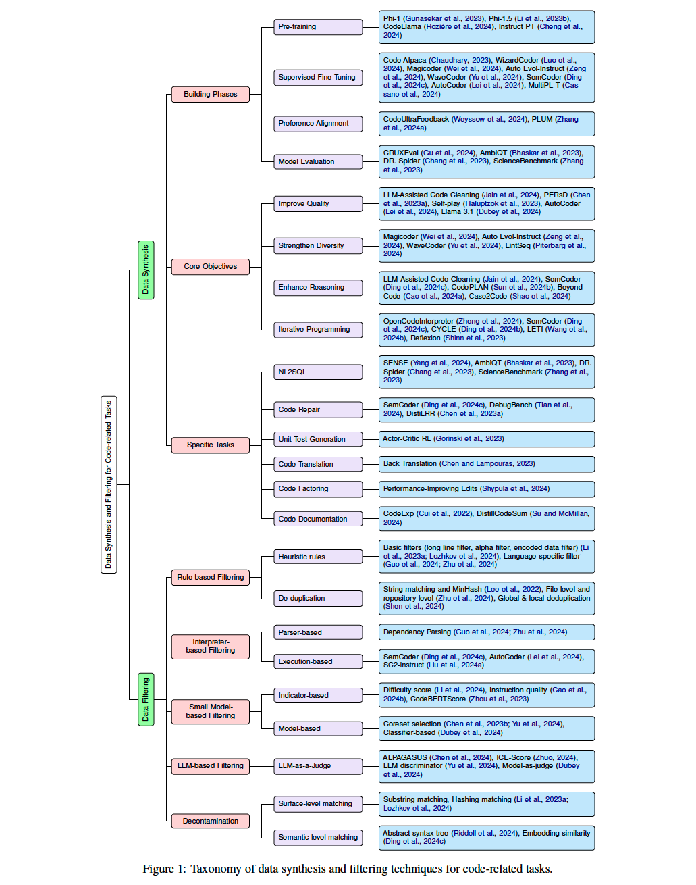

# Awesome Data Synthesis for Code LLMs
This repository accompanies our survey paper "***Mastering the Craft of Data Synthesis for CodeLLMs***", which explores recent advancements in data synthesis and filtering techniques for Code LLMs. It includes a curated collection of relevant papers, datasets, benchmarks, and other resources to support and inspire future research in this rapidly evolving field. We aim to update this repository periodically to reflect the latest developments.

## Table of Contents
### 1. [Open-source Synthetic datasets for Code LLMs](#1-datasets)

| Dataset    | Venue                            | Date              | Size                 | Language                                                                         | Source                                                                                                                                                                                                                                                                                       |
| ------- | -------------------------------- | ---------------------- | -------------------- | -------------------------------------------------------------------------------- | -------------------------------------------------------------------------------------------------------------------------------------------------------------------------------------------------------------------------------------------------------------------------------------------- |
| Code Alpaca | Github                        | 2023                | 20K                 | Multi-lingual (Python, Java, C, ..., etc)                                                                             | "Code Alpaca: An Instruction-following LLaMA model for code generation" [[paper](https://github.com/sahil280114/codealpaca)], [[code](https://github.com/sahil280114/codealpaca)], [[data](https://huggingface.co/datasets/sahil2801/CodeAlpaca-20k)]
| WizardCoder | ICLR 2024                        | 2024                | 78K                 | Multi-lingual (Python, Java, C, ..., etc)                                                                             | "WizardCoder: Empowering Code Large Language Models with Evol-Instruct" [[paper](https://openreview.net/pdf?id=UnUwSIgK5W)], [[code](https://github.com/nlpxucan/WizardLM)], [[data](https://huggingface.co/datasets/WizardLMTeam/WizardLM_evol_instruct_70k)]
| Magicoder | ICML 2024                        | 2024                | 75K                 | Multi-lingual (Python, Java, C, ..., etc)                                                                             | "Magicoder: Source Code Is All You Need" [[paper](https://github.com/sahil280114/codealpaca)], [[code](https://github.com/ise-uiuc/magicoder)], [[data](https://huggingface.co/datasets/ise-uiuc/Magicoder-OSS-Instruct-75K)]
| CodeSeaXDataset |  NeurIPS 2024                       | 2024                | 20K                 | Multi-lingual (Python, Java, C, ..., etc)                                                                             | "WaveCoder: Widespread And Versatile Enhanced Code LLM" [[paper](https://arxiv.org/abs/2312.14187)], [[code](https://github.com/microsoft/WaveCoder)], [[data]()]
| PYX |  NeurIPS 2024                       | 2024                | 35K                 | Multi-lingual (Python, Java, C, ..., etc)                                                                             | "SemCoder: Training Code Language Models with Comprehensive Semantics Reasoning" [[paper](https://arxiv.org/pdf/2406.01006)], [[code](https://github.com/ARiSE-Lab/SemCoder)], [[data](https://huggingface.co/datasets/semcoder/PyX)]
| PYX-R |  NeurIPS 2024                       | 2024                | 19K                 | Multi-lingual (Python, Java, C, ..., etc)                                                                             | "SemCoder: Training Code Language Models with Comprehensive Semantics Reasoning" [[paper](https://arxiv.org/pdf/2406.01006)], [[code](https://github.com/ARiSE-Lab/SemCoder)], [[data](https://huggingface.co/datasets/semcoder/PyX-R)]
| AutoCoder-AIEV-Instruct |  Arxiv                       | 2024                | 169K                 | Multi-lingual (Python, Java, C, ..., etc)                                                                             | "AutoCoder: Enhancing Code Large Language Model with \textsc{AIEV-Instruct}" [[paper](https://arxiv.org/pdf/2405.14906)], [[code](https://github.com/bin123apple/AutoCoder)], [[data]()]
| MultiPL-T |  ACM Program. Lang                       | 2024                | 215K                 | Low resource language (Lua, Racket, Ocamal, Julia/r)                                                                             | "Knowledge Transfer from High-Resource to Low-Resource Programming Languages for Code LLMs" [[paper](https://arxiv.org/pdf/2308.09895)], [[code](https://github.com/nuprl/MultiPL-T)], [[data](https://huggingface.co/datasets/nuprl/MultiPL-T)]
| CodeUltraFeedback |  Arxiv                       | 2024                | 10K                 | Multi-lingual (Python, Java, C, ..., etc)                                                                             | "CodeUltraFeedback: An LLM-as-a-Judge Dataset for Aligning Large Language Models to Coding Preferences" [[paper](https://arxiv.org/abs/2403.09032)], [[code](https://github.com/martin-wey/CodeUltraFeedback)], [[data](https://huggingface.co/datasets/coseal/CodeUltraFeedback)]
| CRUXEval |  Arxiv                       | 2024                | 800                 | Python                                                                             | "CRUXEval: A Benchmark for Code Reasoning, Understanding and Execution" [[paper](https://arxiv.org/abs/2401.03065)], [[code](https://github.com/facebookresearch/cruxeval)], [[data](https://huggingface.co/datasets/cruxeval-org/cruxeval)]
| AmbiQT |  EMNLP 2023                       | 2023                | 3000                 | SQL                                                                             | "Benchmarking and Improving Text-to-SQL Generation Under Ambiguity" [[paper](https://aclanthology.org/2023.emnlp-main.436.pdf)], [[code](https://github.com/testzer0/AmbiQT)], [[data](https://github.com/testzer0/AmbiQT/tree/master/benchmark)]
| Dr.Spider |  ICLR 2023                       | 2023                | 15K                 | SQL                                                                             | "Dr. Spider: A Diagnostic Evaluation Benchmark towards Text-to-SQL Robustness" [[paper](https://arxiv.org/abs/2301.08881)], [[code](https://github.com/awslabs/diagnostic-robustness-text-to-sql)], [[data](https://github.com/awslabs/diagnostic-robustness-text-to-sql/blob/main/data.tar.gz)]
| ScienceBenchmark |  Arxiv                       | 2023                | 4K                 | SQL                                                                             | "ScienceBenchmark: A Complex Real-World Benchmark for Evaluating Natural Language to SQL Systems" [[paper](https://arxiv.org/abs/2306.04743)], [[code](https://github.com/yizhang-unifr/nl-ql-data-augmentation)], [[data](https://github.com/ckosten/sciencebenchmark_dataset)]
|CodePLAN |  LREC 2024                       | 2024                | 11K                 | Python                                                                             | "Enhancing Code Generation Performance of Smaller Models by Distilling the Reasoning Ability of LLMs" [[paper](https://aclanthology.org/2024.lrec-main.521.pdf)], [[code](https://github.com/sssszh/CodePLAN)], [[data](https://github.com/sssszh/CodePLAN)]
| OpenCodeInterpreter |  ACL 2024 Findings                      | 2024                | 68K                 | Python                                                                             | "OpenCodeInterpreter: Integrating Code Generation with Execution and Refinement" [[paper](https://aclanthology.org/2024.findings-acl.762.pdf)], [[code](https://github.com/OpenCodeInterpreter/OpenCodeInterpreter)], [[data](https://huggingface.co/datasets/m-a-p/Code-Feedback)]
| DebugBench |  ACL 2024 Findings                      | 2024                | 4K                 | Python, Java, C++                                                                             | "DebugBench: Evaluating Debugging Capability of Large Language Models" [[paper](https://aclanthology.org/2024.findings-acl.247.pdf)], [[code](https://github.com/thunlp/DebugBench)], [[data](https://huggingface.co/datasets/Rtian/DebugBench)]
| DistiLRR |  Arxiv                       | 2024                | 7K                 | Python, Java, Javascript, Perl, Golang, Swift                                                                             | "DistiLRR: Transferring Code Repair for Low-Resource Programming Languages" [[paper](https://arxiv.org/pdf/2406.14867)], [[code](https://github.com/KyleWong288/Distill_LRPL)], [[data](https://github.com/KyleWong288/Distill_LRPL)]
| PIE |  ICLR 2024                       | 2024                | 1.5K                 | Python                                                                             | "Learning Performance-Improving Code Edits" [[paper](https://openreview.net/pdf?id=ix7rLVHXyY)], [[code](https://github.com/LearningOpt/pie)], [[data](https://github.com/LearningOpt/pie?tab=readme-ov-file#dataset)]
| CodeExp |  EMNLP 2022 Findings                       | 2022                | 13K                 | Python                                                                             | "SemCoder: Training Code Language Models with Comprehensive Semantics Reasoning" [[paper](https://aclanthology.org/2022.findings-emnlp.174.pdf)], [[code](https://github.com/subercui/CodeExp)], [[data](https://github.com/subercui/CodeExp/blob/main/dataset/CodeExp(annotated)13k.json)]
| Jam-CGPT |  Automated Software Engineering 2024                       | 2024                | 2.15M                 | Java                                                                             | "Distilled GPT for Source Code Summarization" [[paper](https://arxiv.org/pdf/2308.14731)], [[code](https://github.com/apcl-research/Jam-CGPT)], [[data](https://huggingface.co/datasets/apcl/Jam-CGPT/tree/main)]
| 🔥 Synthetic-Text-To-SQL |  Huggingface                       | 2024                | 105K                 | SQL                                                                             | "A Synthetic Dataset for Training Language Models to Generate SQL Queries from Natural Language Prompts" [[paper]()], [[code](https://huggingface.co/datasets/gretelai/synthetic_text_to_sql)], [[data](https://huggingface.co/datasets/gretelai/synthetic_text_to_sql)]

### 2. [Benchmarking for Code LLMs](#2-benchmarking)

- [NeurIPS 2021] **CodeXGLUE**: "CodeXGLUE: A Machine Learning Benchmark Dataset for Code Understanding and Generation", [[paper](https://arxiv.org/abs/2102.04664)] [[repo](https://github.com/microsoft/CodeXGLUE)]

- [Arxiv 2021] **HumanEval**: "Evaluating Large Language Models Trained on Code", [[paper](https://arxiv.org/abs/2107.03374)] [[repo](https://github.com/openai/human-eval)]

- [Arxiv 2021] **MBPP**: "Program Synthesis with Large Language Models", [[paper](https://arxiv.org/abs/2108.07732)] [[repo](https://github.com/google-research/google-research/tree/master/mbpp)]

- [Arxiv 2022] **DS-1000**: "DS-1000: A Natural and Reliable Benchmark for Data Science Code Generation", [[paper](https://arxiv.org/abs/2211.11501)] [[repo](https://github.com/xlang-ai/DS-1000)]

- [Arxiv 2023] **HumanEval+**: "Is Your Code Generated by ChatGPT Really Correct? Rigorous Evaluation of Large Language Models for Code Generation", [[paper](https://arxiv.org/abs/2305.01210)] [[repo](https://github.com/evalplus/evalplus)]

- [Arxiv 2023] **HumanEvalPack**, "OctoPack: Instruction Tuning Code Large Language Models", [[paper](https://arxiv.org/abs/2308.07124)] [[repo](https://huggingface.co/datasets/bigcode/humanevalpack)]

- [Arxiv 2024] **BigCodeBench**: "BigCodeBench: Benchmarking Code Generation with Diverse Function Calls and Complex Instructions", [[paper](https://arxiv.org/abs/2406.15877)] [[repo](https://github.com/bigcode-project/bigcodebench)]

- [Arxiv 2024] **LiveCodeBench**: "LiveCodeBench: Holistic and Contamination Free Evaluation of Large Language Models for Code", [[paper](https://arxiv.org/abs/2403.07974)] [[repo](https://github.com/LiveCodeBench/LiveCodeBench)]

- [IEEE Trans. Software Engineering 2022] **MultiPL-E**: "MultiPL-E: A Scalable and Extensible Approach to Benchmarking Neural Code Generation", [[paper](https://arxiv.org/abs/2208.08227)] [[repo](https://github.com/nuprl/MultiPL-E)]

- [Arxiv 2024] **McEval**: "McEval: Massively Multilingual Code Evaluation", [[paper](https://arxiv.org/abs/2406.07436)] [[repo](https://github.com/MCEVAL/McEval)] 

- [ICML 2024] **CRUXEval**: "CRUXEval: A Benchmark for Code Reasoning, Understanding and Execution", [[paper](https://arxiv.org/abs/2401.03065)] [[repo](https://github.com/facebookresearch/cruxeval)] 

- [2024] **Aider**: "Aider is AI pair programming in your terminal", [[repo](https://github.com/Aider-AI/aider)]

- [Arxiv 2024] **Long Code Arena**: "Long Code Arena: a Set of Benchmarks for Long-Context Code Models", [[paper](https://arxiv.org/abs/2406.11612)] [[repo](https://github.com/JetBrains-Research/lca-baselines)]

- [2024] **DebugEval**: Enhancing the Code Debugging Ability of LLMs via Communicative Agent Based Data Refinement [[paper](https://arxiv.org/abs/2408.05006)] [[repo](https://github.com/NEUIR/DebugEval)]

- [EMNLP 2018] **Spider**: "Spider: A Large-Scale Human-Labeled Dataset for Complex and Cross-Domain Semantic Parsing and Text-to-SQL Task", [[paper](https://arxiv.org/abs/1809.08887)] [[repo](https://yale-lily.github.io/spider)]

- [Arxiv 2023] **BIRD**: "Can LLM Already Serve as A Database Interface? A BIg Bench for Large-Scale Database Grounded Text-to-SQLs", [[paper](https://arxiv.org/abs/2305.03111)] [[repo](https://bird-bench.github.io/)]

- 🔥[Arxiv 2024] **Spider 2.0**: "Spider 2.0: Evaluating Language Models on Real-World Enterprise Text-to-SQL Workflows", [[paper](https://arxiv.org/abs/2411.07763)] [[repo](https://github.com/xlang-ai/Spider2)]

### 3. [Recommended Open-source LLMs](#3-recommended-llms)

- **Llama-3.1-405B**:  https://huggingface.co/meta-llama/Llama-3.1-405B

- **Llama-3.2-90B**:  https://huggingface.co/meta-llama/Llama-3.2-90B-Vision-Instruct

- **Qwen2.5-72B-Instruct-GGUF**:  https://huggingface.co/Qwen/Qwen2.5-72B-Instruct-GGUF

- **DeepSeek-Coder-V2-Instruct**:  https://huggingface.co/deepseek-ai/DeepSeek-Coder-V2-Instruct

- **Qwen2.5-Coder-32B-Instruct**:  https://huggingface.co/Qwen/Qwen2.5-Coder-32B-Instruct

- **Starcoder2-15b**:  https://huggingface.co/bigcode/starcoder2-15b

### 4. [Papers](#4-papers)

#### 4.1 [Data Synthesis](#41-data-synthesis)

- Gunasekar et al, Textbooks are all you need, 2023. [[pdf](https://www.microsoft.com/en-us/research/publication/textbooks-are-all-you-need/)]

- Li et al, Textbooks Are All You Need II: phi-1.5 technical report, 2023. [[pdf](https://arxiv.org/abs/2309.05463)]

- Rozière et al, Code Llama: Open Foundation Models for Code, 2023. [[pdf](https://arxiv.org/abs/2308.12950)]

- Chaudhary et al, Code Alpaca: An Instruction-following LLaMA Model trained on code generation instructions, 2023. [[pdf](https://github.com/sahil280114/codealpaca)]

- Luo et al, WizardCoder: Empowering Code Large Language Models with Evol-Instruct, 2024. [[pdf](https://openreview.net/pdf?id=UnUwSIgK5W)]

- Wei et al, Magicoder: Empowering Code Generation with OSS-Instruct, 2024. [[pdf](https://openreview.net/pdf?id=XUeoOBid3x)]

- Zeng et al, Automatic Instruction Evolving for Large Language Models, 2024. [[pdf](https://arxiv.org/abs/2406.00770)]

- Yu et al, WaveCoder: Widespread And Versatile Enhancement For Code Large Language Models By Instruction Tuning, 2024. [[pdf](https://aclanthology.org/2024.acl-long.280.pdf)]

- Ding et al, SemCoder: Training Code Language Models with Comprehensive Semantics Reasoning, 2024. [[pdf](https://arxiv.org/abs/2406.01006)]

- Lei et al, AutoCoder: Enhancing Code Large Language Model with \textsc{AIEV-Instruct}, 2024. [[pdf](https://arxiv.org/abs/2405.14906)]

- Cassano et al, Knowledge Transfer from High-Resource to Low-Resource Programming Languages for Code LLMs, 2023. [[pdf](https://arxiv.org/abs/2308.09895)]

- Weyssow et al, CodeUltraFeedback: An LLM-as-a-Judge Dataset for Aligning Large Language Models to Coding Preferences, 2024. [[pdf](https://arxiv.org/abs/2403.09032)]

- Zhang et al, PLUM: Improving Code LMs with Execution-Guided On-Policy Preference Learning Driven By Synthetic Test Cases, 2024. [[pdf](https://arxiv.org/abs/2406.06887)]

- Gu et al, CRUXEval: A Benchmark for Code Reasoning, Understanding and Execution, 2024. [[pdf](https://arxiv.org/abs/2401.03065)]

- Bhaskar et al, Benchmarking and Improving Text-to-SQL Generation under Ambiguity, 2023. [[pdf](https://aclanthology.org/2023.emnlp-main.436.pdf)]

- Chang et al, Dr.Spider: A Diagnostic Evaluation Benchmark towards Text-to-SQL Robustness, 2023. [[pdf](https://openreview.net/pdf?id=Wc5bmZZU9cy)]

- Zhang et al, ScienceBenchmark: A Complex Real-World Benchmark for Evaluating Natural Language to SQL Systems, 2023. [[pdf](https://arxiv.org/abs/2306.04743)]

- Jain et al, LLM-Assisted Code Cleaning For Training Accurate Code Generators, 2024. [[pdf](https://openreview.net/pdf?id=maRYffiUpI)]

- Chen et al, Personalized Distillation: Empowering Open-Sourced LLMs with Adaptive Learning for Code Generation, 2023. [[pdf](https://aclanthology.org/2023.emnlp-main.417.pdf)]

- Haluptzok et al, Language Models Can Teach Themselves to Program Better, 2023. [[pdf](https://openreview.net/pdf?id=SaRj2ka1XZ3)]

- Dubey et al, The Llama 3 Herd of Models, 2024. [[pdf](https://arxiv.org/abs/2407.21783)]

- Piterbarg et al, Training Language Models on Synthetic Edit Sequences Improves Code Synthesis, 2024. [[pdf](https://arxiv.org/abs/2410.02749)]

- Sun et al, Enhancing Code Generation Performance of Smaller Models by Distilling the Reasoning Ability of LLMs, 2024. [[pdf](https://aclanthology.org/2024.lrec-main.521.pdf)]

- Cao et al, Beyond Code: Evaluate Thought Steps for Complex Code Generation, 2024. [[pdf](https://aclanthology.org/2024.lrec-main.205.pdf)]

- Shao et al, Case2Code: Learning Inductive Reasoning with Synthetic Data, 2024. [[pdf](https://arxiv.org/abs/2407.12504)]

- Zheng et al, OpenCodeInterpreter: Integrating Code Generation with Execution and Refinement, 2024. [[pdf](https://aclanthology.org/2024.findings-acl.762.pdf)]

- Ding et al, CYCLE: Learning to Self-Refine the Code Generation, 2024. [[pdf](https://arxiv.org/abs/2403.18746)]

- Wang et al, LETI: Learning to Generate from Textual Interactions, 2024. [[pdf](https://aclanthology.org/2024.findings-naacl.16.pdf)]

- Shinn et al, Reflexion: language agents with verbal reinforcement learning, 2023. [[pdf](https://openreview.net/pdf?id=vAElhFcKW6)]

- Yang et al, Synthesizing Text-to-SQL Data from Weak and Strong LLMs, 2024. [[pdf](https://aclanthology.org/2024.acl-long.425.pdf)]

- Tian et al, DebugBench: Evaluating Debugging Capability of Large Language Models, 2024. [[pdf](https://aclanthology.org/2024.findings-acl.247.pdf)]

- Gorinski et al, Automatic Unit Test Data Generation and Actor-Critic Reinforcement Learning for Code Synthesis, 2023. [[pdf](https://aclanthology.org/2023.findings-emnlp.28.pdf)]

- Chen et al, Exploring Data Augmentation for Code Generation Tasks, 2023. [[pdf](https://aclanthology.org/2023.findings-eacl.114.pdf)]

- Shypula et al, Learning Performance-Improving Code Edits, 2024. [[pdf](https://openreview.net/pdf?id=ix7rLVHXyY)]

- Cui et al, CodeExp: Explanatory Code Document Generation, 2022. [[pdf](https://aclanthology.org/2022.findings-emnlp.174.pdf)]

- Su et al, Distilled GPT for Source Code Summarization, 2023. [[pdf](https://arxiv.org/pdf/2308.14731)]

- 🔥 Hui et al, Qwen2.5-Coder Technical Report, 2024. [[pdf](https://arxiv.org/abs/2409.12186)]

- 🔥 Pourreza et al, SQL-GEN: Bridging the Dialect Gap for Text-to-SQL Via Synthetic Data And Model Merging, 2024. [[pdf](https://arxiv.org/abs/2408.12733v2)]

#### 4.2 [Data Filtering](#42-coding-filtering)

- Li et al, StarCoder: may the source be with you!, 2023. [[pdf](https://arxiv.org/abs/2305.06161)]

- Lozhkov et al, StarCoder 2 and The Stack v2: The Next Generation, 2024. [[pdf](https://arxiv.org/abs/2402.19173)]

- Guo et al, DeepSeek-Coder: When the Large Language Model Meets Programming -- The Rise of Code Intelligence, 2024. [[pdf](https://arxiv.org/abs/2401.14196)]

- Zhu et al, DeepSeek-Coder-V2: Breaking the Barrier of Closed-Source Models in Code Intelligence, 2024. [[pdf](https://arxiv.org/abs/2406.11931)]

- Lee et al, Deduplicating Training Data Makes Language Models Better, 2022. [[pdf](https://aclanthology.org/2022.acl-long.577.pdf)]

- Shen et al, SlimPajama-DC: Understanding Data Combinations for LLM Training, 2023. [[pdf](https://arxiv.org/abs/2309.10818)]

- Wei et al, SelfCodeAlign: Self-Alignment for Code Generation, 2024. [[pdf](https://arxiv.org/abs/2410.24198)]

- Li et al, Superfiltering: Weak-to-Strong Data Filtering for Fast Instruction-Tuning, 2024. [[pdf](https://aclanthology.org/2024.acl-long.769.pdf)]

- Cao et al, Instruction Mining: Instruction Data Selection for Tuning Large Language Models, 2023. [[pdf](https://arxiv.org/abs/2307.06290)]

- Zhou et al, CodeBERTScore: Evaluating Code Generation with Pretrained Models of Code, 2023. [[pdf](https://aclanthology.org/2023.emnlp-main.859.pdf)]

- Chen et al, Maybe Only 0.5% Data is Needed: A Preliminary Exploration of Low Training Data Instruction Tuning, 2023. [[pdf](https://arxiv.org/abs/2305.09246)]

- Chen et al, AlpaGasus: Training a Better Alpaca with Fewer Data, 2024. [[pdf](https://openreview.net/pdf?id=FdVXgSJhvz)]

- Zhuo et al, ICE-Score: Instructing Large Language Models to Evaluate Code, 2024. [[pdf](https://aclanthology.org/2024.findings-eacl.148.pdf)]

- Riddell et al, Quantifying Contamination in Evaluating Code Generation Capabilities of Language Models, 2024. [[pdf](https://aclanthology.org/2024.acl-long.761.pdf)]

- 🔥 Wang et al, How Do Your Code LLMs Perform? Empowering Code Instruction Tuning with Really Good Data, 2024. [[pdf](https://aclanthology.org/2024.emnlp-main.777.pdf)]

